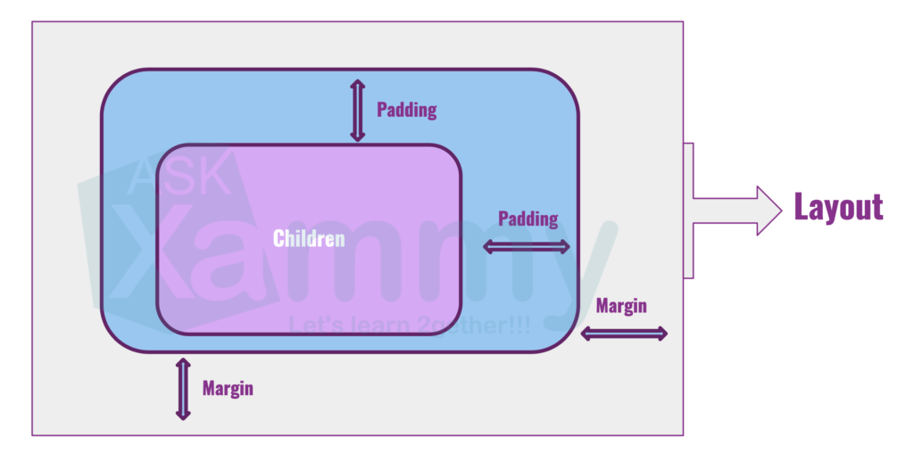

# xamarin-learning-journey

[toc]

## C#


## Xamarin.Forms tutorials

### StackLayout

Difference between ```Margin``` and ```Padding```



### Grid


## XAML

### Anatomy of a XAML File

- **MainPage.xaml**, the XAML file; and
- **MainPage.xaml.cs**, the C# code-behind file.

```xaml
<ContentPage xmlns="http://xamarin.com/schemas/2014/forms"
             xmlns:x="http://schemas.microsoft.com/winfx/2009/xaml"
             xmlns:local="clr-namespace:XamlSamples"
             x:Class="XamlSamples.MainPage"> // The x:Class attribute specifies a fully qualified .NET class name: the MainPage class in the XamlSamples namespace. This means that this XAML file defines a new class named MainPage in the XamlSamples namespace that derives from ContentPage—the tag in which the x:Class attribute appears.

    <StackLayout>
        <!-- Place new controls here -->
        <Label Text="Welcome to Xamarin Forms!"
               VerticalOptions="Center"
               HorizontalOptions="Center" />
    </StackLayout>

</ContentPage>
```

> When Visual Studio builds the project, it parses the XAML file to generate a C# code file. If you look in the **XamlSamples\XamlSamples\obj\Debug** directory, you’ll find a file named **XamlSamples.MainPage.xaml.g.cs**. The ‘g’ stands for generated. This is the other partial class definition of `MainPage` that contains the definition of the `InitializeComponent` method called from the `MainPage` constructor. These two partial `MainPage` class definitions can then be compiled together. Depending on whether the XAML is compiled or not, either the XAML file or a binary form of the XAML file is embedded in the executable.
>
>  At runtime, code in the particular platform project calls a `LoadApplication` method, passing to it a new instance of the `App` class in the .NET Standard library. The `App` class constructor instantiates `MainPage`. The constructor of that class calls `InitializeComponent`, which then calls the `LoadFromXaml` method that extracts the XAML file (or its compiled binary) from the .NET Standard library. `LoadFromXaml` initializes all the objects defined in the XAML file, connects them all together in parent-child relationships, attaches event handlers defined in code to events set in the XAML file, and sets the resultant tree of objects as the content of the page.


### XAML and Code Interactions

#### XAML identifies Code

In the Code file, define handlers:

```c#
...

        void OnSliderValueChanged(object sender, ValueChangedEventArgs args)
        {

        }

        void OnButtonClicked(object sender, EventArgs args)
        {

        }
...
```

In the XAML files, include attributes for the events that reference these handlers:

```xaml
...
    <StackLayout>
        <Slider VerticalOptions="CenterAndExpand"
                ValueChanged="OnSliderValueChanged" />
...

        <Button Text="Click Me!"
                HorizontalOptions="Center"
                VerticalOptions="CenterAndExpand"
                Clicked="OnButtonClicked" />
    </StackLayout>
</ContentPage>
```

#### Code identifies XAML

Specify with ```x:Name``` attribute:

```xaml
<Label x:Name="valueLabel"
       Text="A simple Label"
       Font="Large"
       HorizontalOptions="Center"
       VerticalOptions="CenterAndExpand" />
```

Use it in code:

```c#
void OnSliderValueChanged(object sender, ValueChangedEventArgs args)
{
    valueLabel.Text = args.NewValue.ToString("F3");
}
```

