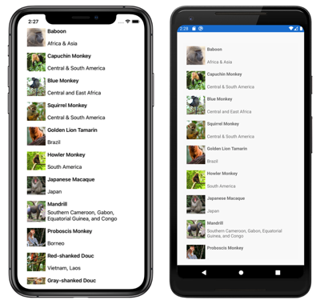

# xamarin-learning-journey

[toc]

## C#

> WIP


## Xamarin.Forms tutorials

### StackLayout

Difference between ```Margin``` and ```Padding```

```xaml
    <StackLayout Margin="20,35,20,20">
    </StackLayout>
```


### Button

Handle clicks by setting the `Clicked` event to an event handler from code:

```xaml
<Button Text="Click me"
        Clicked="OnButtonClicked" />
```

```c#
void OnButtonClicked(object sender, EventArgs e)
{
    (sender as Button).Text = "Click me again!";
}
```

### Image

The `OnPlatform` markup extension enables you to customize UI appearance on a per-platform basis. 

```xaml
<Image Source="XamarinLogo"
       WidthRequest="{OnPlatform iOS=300, Android=250}"
       HorizontalOptions="Center" />
```

### Grid

Use **span** to occupy multiple rows or columns

```xaml
<Grid Margin="20,35,20,20">
    <Grid.ColumnDefinitions>
        <ColumnDefinition Width="0.5*" />
        <ColumnDefinition Width="0.5*" />
    </Grid.ColumnDefinitions>
    <Grid.RowDefinitions>
        <RowDefinition Height="50" />
        <RowDefinition Height="30" />
        <RowDefinition Height="30" />
    </Grid.RowDefinitions>
    <Label Grid.ColumnSpan="2"
           Text="This text uses the ColumnSpan property to span both columns." />
    <Label Grid.Row="1"
           Grid.RowSpan="2"
           Text="This text uses the RowSpan property to span two rows." />
</Grid>
```

### CollectionView

Binds the `ItemsSource` property to the property in code as a data source of the collection view:

```xaml
// XAML
<CollectionView ItemsSource="{Binding Monkeys}" />
```

```c#
// Code

        public MainPage()
        {
            InitializeComponent();

            Monkeys = new List<Monkey>();
            Monkeys.Add(new Monkey
            {
                Name = "Baboon",
                Location = "Africa & Asia"
            });
						
            BindingContext = this;
        }
```

Respond to item selection:

```xaml
// XAML
<CollectionView ItemsSource="{Binding Monkeys}"
                SelectionMode="Single"
                SelectionChanged="OnSelectionChanged" />
```

```c#
// Code
void OnSelectionChanged(object sender, SelectionChangedEventArgs e)
{
    Monkey selectedItem = e.CurrentSelection[0] as Monkey;
}
```

Use `DataTemplate` property to customize item appearance:

```xaml
<CollectionView ItemsSource="{Binding Monkeys}"
                SelectionMode="Single"
                SelectionChanged="OnSelectionChanged">
    <CollectionView.ItemTemplate>
        <DataTemplate>
            <Grid Padding="10"
                  RowDefinitions="Auto, *"
                  ColumnDefinitions="Auto, *">
                <Image Grid.RowSpan="2"
                       Source="{Binding ImageUrl}"
                       Aspect="AspectFill"
                       HeightRequest="60"
                       WidthRequest="60" />
                <Label Grid.Column="1"
                       Text="{Binding Name}"
                       FontAttributes="Bold" />
                <Label Grid.Row="1"
                       Grid.Column="1"
                       Text="{Binding Location}"
                       VerticalOptions="End" />
            </Grid>
        </DataTemplate>
    </CollectionView.ItemTemplate>
</CollectionView>
```



### Alert

```c#
// Alert with 1 option
await DisplayAlert("Alert", "This is an alert.", "OK");

// Alert with 2 options
bool response = await DisplayAlert("Save?", "Would you like to save your data?", "Yes", "No");

// Bottom sheet with several options
string action = await DisplayActionSheet("Send to?", "Cancel", null, "Email", "Twitter", "Facebook");
```

### App Lifecycle

> - The `OnStart` method is invoked when the application starts.
> - The `OnSleep` method is invoked when the application goes to the background.
> - The `OnResume` method is invoked when the application resumes from the background.

**App singleton**

```c#
(Application.Current as App).DisplayText = entry.Text; // Get App singleton
```

**Properties dictionary for lightweight local storage**

The [`Application`](https://learn.microsoft.com/en-us/dotnet/api/xamarin.forms.application) subclass has a static [`Properties`](https://learn.microsoft.com/en-us/dotnet/api/xamarin.forms.application.properties#xamarin-forms-application-properties) dictionary that can be used to store data across lifecycle state changes. 

> Just similar to `UserDefaults` in iOS development

```c#
// Read value
if (Properties.ContainsKey(displayText))
{
		DisplayText = (string)Properties[displayText];
}
// Save value
Properties[displayText] = DisplayText;
```


## XAML

### Anatomy of a XAML File

- **MainPage.xaml**, the XAML file; and
- **MainPage.xaml.cs**, the C# code-behind file.

```xaml
<ContentPage xmlns="http://xamarin.com/schemas/2014/forms"
             xmlns:x="http://schemas.microsoft.com/winfx/2009/xaml"
             xmlns:local="clr-namespace:XamlSamples"
             x:Class="XamlSamples.MainPage"> // The x:Class attribute specifies a fully qualified .NET class name: the MainPage class in the XamlSamples namespace. This means that this XAML file defines a new class named MainPage in the XamlSamples namespace that derives from ContentPage—the tag in which the x:Class attribute appears.

    <StackLayout>
        <!-- Place new controls here -->
        <Label Text="Welcome to Xamarin Forms!"
               VerticalOptions="Center"
               HorizontalOptions="Center" />
    </StackLayout>

</ContentPage>
```

> When Visual Studio builds the project, it parses the XAML file to generate a C# code file. If you look in the **XamlSamples\XamlSamples\obj\Debug** directory, you’ll find a file named **XamlSamples.MainPage.xaml.g.cs**. The ‘g’ stands for generated. This is the other partial class definition of `MainPage` that contains the definition of the `InitializeComponent` method called from the `MainPage` constructor. These two partial `MainPage` class definitions can then be compiled together. Depending on whether the XAML is compiled or not, either the XAML file or a binary form of the XAML file is embedded in the executable.
>
>  At runtime, code in the particular platform project calls a `LoadApplication` method, passing to it a new instance of the `App` class in the .NET Standard library. The `App` class constructor instantiates `MainPage`. The constructor of that class calls `InitializeComponent`, which then calls the `LoadFromXaml` method that extracts the XAML file (or its compiled binary) from the .NET Standard library. `LoadFromXaml` initializes all the objects defined in the XAML file, connects them all together in parent-child relationships, attaches event handlers defined in code to events set in the XAML file, and sets the resultant tree of objects as the content of the page.


### XAML and Code Interactions

#### XAML identifies Code

In the Code file, define handlers:

```c#
...

        void OnSliderValueChanged(object sender, ValueChangedEventArgs args)
        {

        }

        void OnButtonClicked(object sender, EventArgs args)
        {

        }
...
```

In the XAML files, include attributes for the events that reference these handlers:

```xaml
...
    <StackLayout>
        <Slider VerticalOptions="CenterAndExpand"
                ValueChanged="OnSliderValueChanged" />
...

        <Button Text="Click Me!"
                HorizontalOptions="Center"
                VerticalOptions="CenterAndExpand"
                Clicked="OnButtonClicked" />
    </StackLayout>
</ContentPage>
```

#### Code identifies XAML

Specify with ```x:Name``` attribute:

```xaml
<Label x:Name="valueLabel"
       Text="A simple Label"
       Font="Large"
       HorizontalOptions="Center"
       VerticalOptions="CenterAndExpand" />
```

Use it in code:

```c#
void OnSliderValueChanged(object sender, ValueChangedEventArgs args)
{
    valueLabel.Text = args.NewValue.ToString("F3");
}
```

